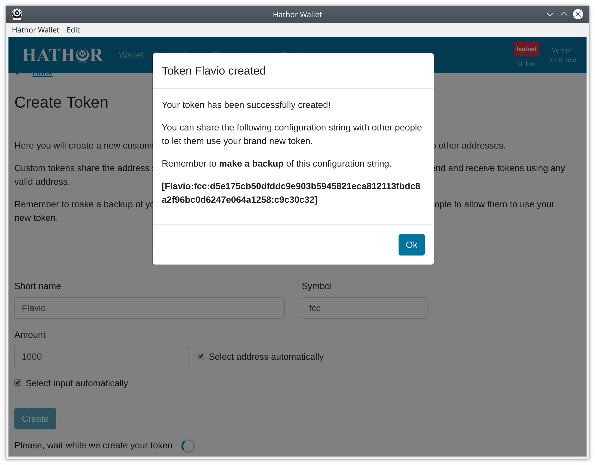

# Introduction to Hathor
In this lecture we will get acquainted with [Hathor Network](https://hathor.network). Hathor is a blockchain and criptocurrency 
platform, which seeks to deliver on the holy grail of transactions scalabitlity by combining the best of the Bitcoin proof-of-work
based consensus and fee-less transactions tipically associated with DAG-based blockchains. 

Throughout this lecture we will learn how to:
 - Download and setup a Hathor Wallet;
 - Set up you box to mine Hathors;
 - Create a new token 
 
## Setting up a Hathor Wallet
The Hathor wallet is realy easy to install. You can find an appropriate download for your operating system [here](https://hathor.network/get-started/). Just download and follow the instructions. 
 

 
## Start mining Hathors!
In order to start mining you first need to download the source code of the mining daemon and compile it locally. So far I have not found a pre-compiled miner ready for download and use. But compiling is not too complicated. Here I'll assume you will be doing it on an Ubuntu linux box like I did. Let's start with the [cpuminer](https://github.com/HathorNetwork/cpuminer). First clone the source code.

```bash
$ git clone https://github.com/HathorNetwork/cpuminer.git
```

The next step is to install some dependencies. Make sure you have performed the most basic step towards getting your OS ready to compile C code:

```bash
$ sudo apt install build-essentials
$ sudo apt install autoconf
```

Then you should install a could of libraries needed by the miner itself:
```bash
$ sudo apt install libcurl4-openssl-dev
$ sudo apt install libjansson-dev
```

Now you are ready to compile the cpuminer:

```bash
$ ./autoge.sh
$ ./configure CFLAGS="-O3" # Make sure -O3 is an O and not a zero!
$ make
```
After the compilation is done, you are ready to start mining! But you still need a couple of extra bits of information:
 - the url of a full node of the Hathor testnet
 - Wallet address to save the Hathors you mine!
 
 If you have already configured the Hathor Wallet, You already have an address. The host to connect to can be found [here](https://hathor.network/testnet/#nodes). I have used this one: stratum.node5.alpha.testnet.hathor.network:8081
 
 Here is how you start the miner:
 
 ```bash
 $ ./minerd -a sha256d -o stratum+tcp://stratum.node5.alpha.testnet.hathor.network:8081 --coinbase-addr {address}
 ```
 replace `{address}` with you address.
 
 ### Building the GPU miner(ccminer)
 I you have an cuda-capable NVIDIA GPU on your box, it may be worth trying the GPU miner:
Start by downloading the source code from [here](https://github.com/HathorNetwork/ccminer).
Then build it like this:
```bash
$ ./build.sh
```
Then, after the compilation finishes you are ready to start mining:
```bash
$ ./ccminer -a sha256d -o stratum+tcp://stratum.node5.alpha.testnet.hathor.network:8081 --coinbase-addr {address}
```
GPU mining is much faster, on my laptop, with a NVDIA GEFORCE MX150, I got 155 MH/s(Mega hashes per second). After about 5 minutes of mining with ccminer I had already mined my first block and got 20 hathor as a reward.

 
 ## Creating a new Token
 In order to create a new token you must have some Hathor in your wallet that's why I showed you how to mine first. Assuming You have managed to mine a few hathors, you can go to the custom Tokens menu on the hathor wallet, enter the name and symbol of the toke you want to create, as well as the amount of tokens. Like I did:
 
 Once you do it, you new tokens show up on you wallet's ballance.
 
