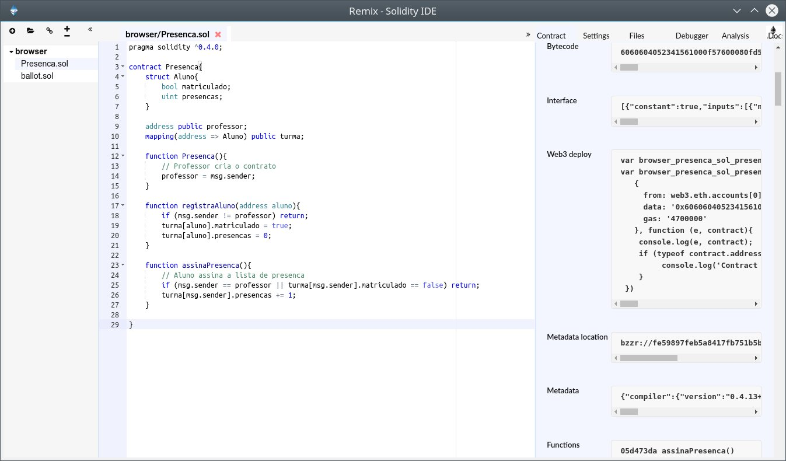

# Introdução à linguagem Solidity

A linguagem **Solidity** é a linguagem padrão para desenvolvimento de *smart contracts*.

Esta linguagem foi concebida intencional mente para ser simples e limitada de maneira a facilitar a análise de contratos
 e tornar os *smart contracts* o mais determinísticos quanto possível.
 
Nós vamos guiar o nosso estudo inicial pela análise de um [contrato](/contracts/Lista_de_Presenca/Presenca.sol) muito simples criado para este curso.

Se você está seguindo este curso, já tem o seu ambiente de desnvolvimento configurado. Abra o *Mist* e a partir do menu *Desenvolvimento* selecione *Open Remix IDE*. Abaixo vai a minha janela do Remix já com um contrato aberto.



O *Remix* é uma IDE muito eficiente para a construção de contratos na linguagem *Solidity*.

## Começando a Programar em Solidity

Vamos começar aos poucos a construir um contrato para servir de registro de presenças em um curso, entre os alunos e o professor.

a Primeira linha de comando que se escreve em um contrato é a seguinte:

```solidity
pragma solidity ^0.4.0;
```

Esta linha basicamente especifica ao compilador qual a versão da linguagem está sendo usada neste programa.

Um contrato na Plataforma *Ethereum* Significa um conjunto de funções e dados que vive em um endereço na blockchain.
Qualquer pessoa que saiba este endereço pode interagir com o contrato, por exemplo, chamando suas funções mas as regras são inteiramente definidas pelo contrato.

Vamos inciar um contrato:

```solidity
pragma solidity ^0.4.0;

contract Presenca{

}
```

A palavra reservada `contract` identifica um bloco de código delimitado por chaves, com um Nome. No caso deste exemplo, o nome é `Presenca`.

Uma vez criado o contrato, podemos começar a pensar no que consistirá o "estado" do contrato. Qualquer programa no sentido de *Turing* é uma máquina de estados, com uma lógica explícita de como este estado pode ser alterado.

Com um Contrato escrito em Solidity não é diferente. Neste contrato seu estado é essencialmente a lista de presença de um curso.

```solidity
pragma solidity ^0.4.0;

contract Presenca{
    struct Aluno{
        bool matriculado;
        uint presencas;
    }

    address public professor;
    mapping(address => Aluno) public turma;
}
```
Para registrar presença precisamos de, no mínimo, duas infomações: uma identificação dos alunos inscritos, e o número de presenças registradas.

Para registrar esta informação, criamos acima uma Estrutura de dados do tipo `struct` para representar o aluno e seus dados. Para complementar, adicionamos também uma variável do tipo `address` que identifica o professor, eu outra estrutura de dados do tipo `mapping` para representar a turma, ou o conjunto dos alunos.

Por enquanto o nosso contrato não tem lógica, apenas estado. Para sanar esta deficiência vamos adicionar mais um componente, uma função, que funcionará como construtor do nosso contrato, ou seja será executado apenas no momento da criação do contrato.

```solidity
pragma solidity ^0.4.0;

contract Presenca{
    struct Aluno{
        bool matriculado;
        uint presencas;
    }

    address public professor;
    mapping(address => Aluno) public turma;

    function Presenca(){
        // Professor cria o contrato
        professor = msg.sender;
    }
}
```

O Construtor de um contrato é uma função com o mesmo nome do contrato. Nosso construtor realiza uma ação simples porém fundamental. Registra o criador do contrato como o professor.
Isto é importante pois professor e alunos terão direitos distintos neste contrato.

O proximo passo é extender o código para permitira formação da turma. Vamos dar o Professor o direito de matricular os alunos.

```solidity
pragma solidity ^0.4.0;

contract Presenca{
    struct Aluno{
        bool matriculado;
        uint presencas;
    }

    address public professor;
    mapping(address => Aluno) public turma;

    function Presenca(){
        // Professor cria o contrato
        professor = msg.sender;
    }

    function registraAluno(address aluno){
        if (msg.sender != professor) return;
        turma[aluno].matriculado = true;
        turma[aluno].presencas = 0;
    }
}
```
A função `registraAluno` toma com argumento, um endereço e verifica na sua primeira linha se que enviou a transação foi o professor. Se não tiver sido ela apenas retorna sem nada executar. Caso contrário, ela adiciona o aluno à turma modificando suas propriedades `matriculado` para `true` e `presencas` para 0.
Note que não é necessário *instanciar* uma variável de tipo `Aluno` e depois inseri-la na turma, pois o `mapping` já criará a variável tipo `Aluno`, automáticamente.

Agora falta incluir código que permita que os alunos também interajam com o contrato. E neste caso, a sua interação se restringirá em assinar a lista de presença.

```solidity
pragma solidity ^0.4.0;

contract Presenca{
    struct Aluno{
        bool matriculado;
        uint presencas;
    }

    address public professor;
    mapping(address => Aluno) public turma;

    function Presenca(){
        // Professor cria o contrato
        professor = msg.sender;
    }

    function registraAluno(address aluno){
        if (msg.sender != professor) return;
        turma[aluno].matriculado = true;
        turma[aluno].presencas = 0;
    }

    function assinaPresenca(){
        // Aluno assina a lista de presenca
        if (msg.sender == professor || turma[msg.sender].matriculado == false) return;
        turma[msg.sender].presencas += 1;
    }

}
```
A função `assinaPresenca` basicamente incremente as presenças do aluno que a invoca. Ela só alteraráo estado do contrato se for invocada por um aluno matriculado.

Agora nosso contrato está completo e já podemos verificar se está compilando, e finalmente cria-lo na blockchain.
